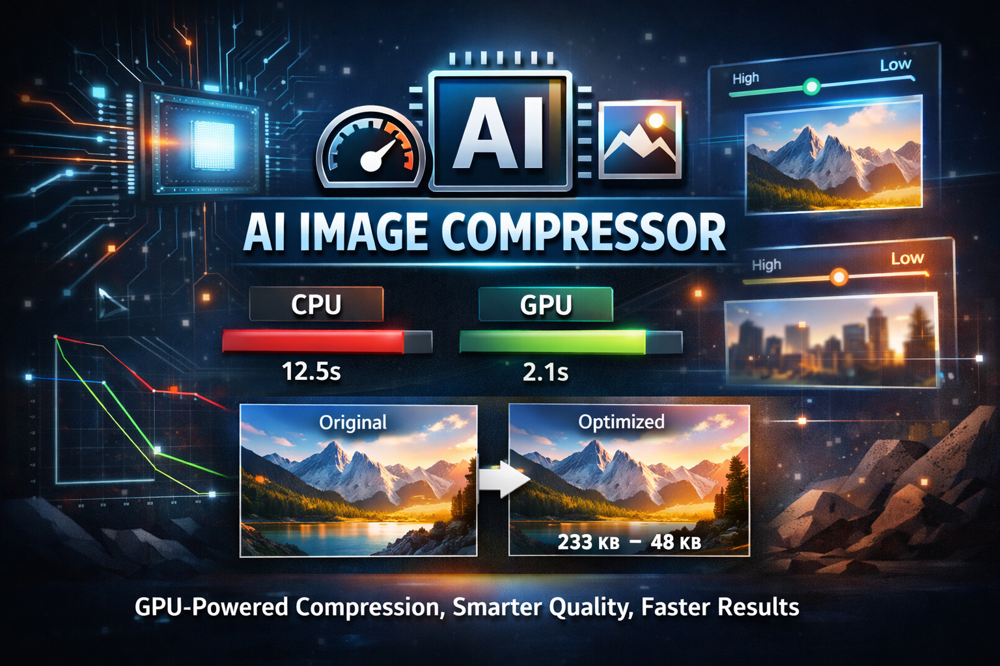

<p align="center">
  
</p>

# img-compressor

A high-performance GPU-accelerated JPEG compressor written in C++ and CUDA.  
The tool supports both CPU and GPU paths for comparing compression performance and output quality.

In addition to standard quality-based compression, the tool supports **content-aware quality mapping**, which preserves visual detail in perceptually important regions while applying stronger compression elsewhere. Optional debug outputs make it easy to inspect and verify how quality is distributed across the image.

This utility demonstrates efficient RGB image compression using CUDA kernels and a custom JPEG scanline writer, 
with optional CPU comparison for benchmarking and verification.

---

## Features

- GPU-accelerated image compression (CUDA)
- Optional CPU comparison mode (`--compare`)
- Quality control with `--quality` parameter
- Content-aware quality mapping with visual debug outputs
- Simple CLI tool

---

## Requirements

- **Visual Studio 2022** with Desktop Development for C++
- **CUDA Toolkit 13.0** or later
- **vcpkg** (for dependency management)

---

## Download

**Prebuilt binaries available on the
[Releases page](https://github.com/bfalls/img-compressor/releases)**

Supports:
- Windows (x64)

## Build Instructions (Visual Studio)

1. Clone this repository:
   ```bash
   git clone https://github.com/bfalls/img-compressor.git
   cd img-compressor
   ```

2. Make sure you have vcpkg installed and integrated with Visual Studio:
    ```bash
    C:\vcpkg\vcpkg integrate install
    ```

3. Open img-compressor.sln in Visual Studio.

4. Select the desired configuration:
   Debug x64 (default for development)
   Release x64 (optimized for speed)

5. Build the project (Ctrl+Shift+B or Build -> Build Solution).
  
6. Or build on the command line:
   ```powershell
   msbuild img-compressor.sln "/t:Clean;Build" /p:Configuration=Debug /p:Platform=x64 /m /verbosity:minimal
   msbuild img-compressor.sln "/t:Clean;Build" /p:Configuration=Release /p:Platform=x64 /m /verbosity:minimal
   ```

7. A sample image is included under tests\data\img-test.png.
   Run the compressor from the project root after building:
   ```powershell
    .\x64\Debug\img-compressor.exe --input tests\data\img-test.png --output tests\artifacts\out.jpg --quality 85 --compare
   ```

   If you don't have a GPU it will just use the CPU path.
   See the timings comparison and don't forget to view the images.
   Try different quality settings!

   ```shell
   [GPU] wrote .\tests\artifacts\out-gpu.jpg in 19.855 ms
   [CPU] wrote .\tests\artifacts\out-cpu.jpg in 402.399 ms
   ```

### Quick demos

**Baseline (no quality map):**

```powershell
.\x64\Debug\img-compressor.exe --input tests\data\img-test.png --output tests\artifacts\out.jpg --quality 85 --compare
```

This runs GPU (if available) and CPU, writing `out-gpu.jpg` / `out-cpu.jpg` plus a timing/size table.

**Content-aware quality map (with debug outputs):**

```powershell
.\x64\Debug\img-compressor.exe --input tests\data\img-test.png --output tests\artifacts\out.jpg --quality 85 --compare --quality-map --quality-map-debug tests\artifacts
```

Flags of interest:
- `--quality-map`: enable saliency-based, per-block coefficient scaling.
- `--quality-map-strength <0..1>`: blend amount (default `0.6`).
- `--quality-map-min-scale` / `--quality-map-max-scale`: bounds for per-block scaling (defaults `0.7` / `1.6`).
- `--quality-map-debug <dir>`: writes `importance_heatmap.pgm` and `block_map.csv` to the directory you provide. When combining `--compare` + `--quality-map`, debug artifacts auto-drop next to the output if you omit this flag.

The quality-map run outputs GPU/CPU JPEGs (with `-gpu`/`-cpu` suffixes), a comparison table (size, time, PSNR vs GPU when applicable), and the saliency heatmap/CSV for inspection.

   [](https://hits.sh/github.com/bfalls/img-compressor/)
